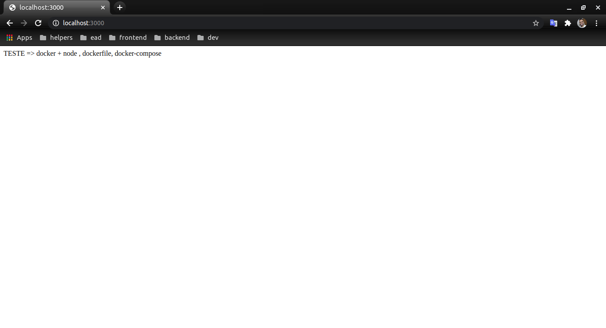
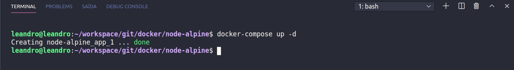

<h1 align="center">
     <a href="#" alt="">Imagem node-alpine</a>
</h1>

<h4 align="center">
	🚧   Concluído 🚀 🚧
</h4>

Tabela de conteúdos
<!--ts-->
   * [Sobre o projeto](#-sobre-o-projeto)
   * [Funcionalidades](#-funcionalidades)
   * [Layout](#-layout)
   * [Como executar o projeto](#-como-executar-o-projeto)
     * [Pré-requisitos](#pré-requisitos)
     * [Rodando o Projeto](#user-content--rodando-o-projeto)
   * [Tecnologias](#-tecnologias)
<!--te-->

## 💻 Sobre o projeto

Cria um registro no arquivo `hosts` para apontar` node-docker.local` para o ambiente do Docker, ou seja, imagem do docker com node sobre um servidor express

---

## ⚙️ Funcionalidades

- [x] Inicia servidor express com node como serviço

---

## 🎨 Layout

O layout da aplicação em local host:8080 com navegador e no terminal 

  
</p>

  
</p>


---

## 🚀 Como executar o projeto
### Pré-requisitos

Antes de começar, você vai precisar ter instalado em sua máquina as seguintes ferramentas:
[Git](https://git-scm.com), [Docker](https://docs.docker.com/engine/install/ubuntu/). 

Além disto é bom ter um editor para trabalhar com o código como [VSCode](https://code.visualstudio.com/) e também um navegador/Browser de sua escolha eu escolhi [Chorme](https://www.google.pt/intl/pt-PT/chrome/?brand=CHBD&gclid=CjwKCAjw1ej5BRBhEiwAfHyh1CqpdiJkRowiF7qVChVWvkTImra14_fVqzdcxXeYoznuxbgYMmtS9BoCP4oQAvD_BwE&gclsrc=aw.ds)

#### 🎲 Rodando o Projeto

```bash

# Clone este repositório
$ git clone git@github.com:leandrojsantos/docker.git

# Acesse a pasta do projeto no terminal/cmd
$ cd docker/node-alpine

# dentro da pasta nginx-php que e a raiz do projeto e com docker instalado
$ docker-compose up -d

# O servidor/docker inciará na porta:3000 - acesse http://localhost:3000  

```
---

## 🛠 Tecnologias

As seguintes ferramentas foram usadas na construção do projeto:

**Server**  
* [Git](https://git-scm.com) 
* [Docker](https://docs.docker.com/engine/install/ubuntu/)
* [VSCode](https://code.visualstudio.com/)
* [Chorme](https://www.google.pt/intl/pt-PT/chrome/?brand=CHBD&gclid=CjwKCAjw1ej5BRBhEiwAfHyh1CqpdiJkRowiF7qVChVWvkTImra14_fVqzdcxXeYoznuxbgYMmtS9BoCP4oQAvD_BwE&gclsrc=aw.ds)
* [Express](https://expressjs.com//)
* [Nodemon](https://nodemon.io/)


